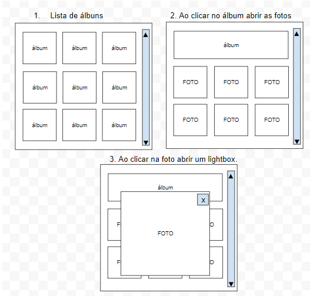

## Teste Técnico - Photo App

Considerando a arquitetura básica utilizando React + (Mobx ou REDUX), criar uma app contemplando as 3 telas:

`

Consumir a seguinte api:

https://jsonplaceholder.typicode.com/photos
